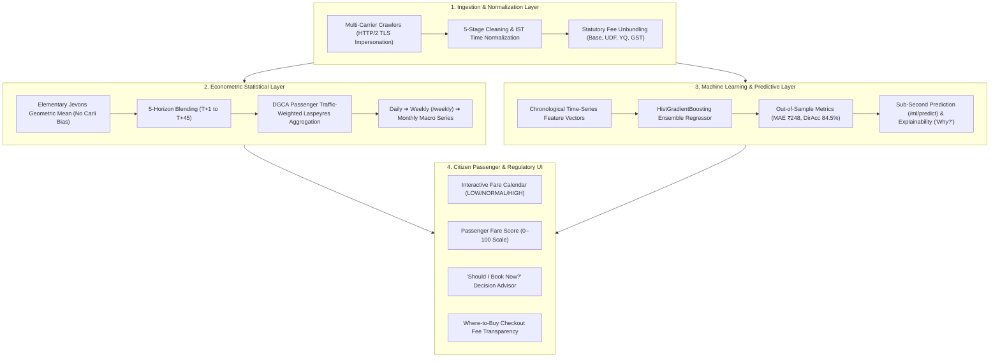

# VAYU-CPI — Real-Time Airfare Price Index for India

> **Development of a Real-time Airfare Price Index for India through Automated Web Scraping of Airline and Online Travel Aggregator Portals for Augmentation of the Consumer Price Index (CPI)**

**Smart India Hackathon (SIH)**
- **Ministry**: Ministry of Statistics and Programme Implementation (MoSPI)
- **Department**: Data Informatics & Innovation Division (DIID)
- **Category**: Software
- **Theme**: Smart Automation
- **Base Year Benchmark**: 2024 = 100

---

## 1. Problem Statement & Motivation

### Why Existing Manual Airfare Collection is Insufficient
Currently, statistical authorities face severe challenges in capturing air travel pricing for the Consumer Price Index (CPI) transport commodity basket:
1. **High Volatility & Dynamic Pricing**: Airfares fluctuate continuously based on demand surges, advance purchase timing, and algorithmic revenue management systems. Manual periodic quotation sampling fails to capture intramonth price dynamics.
2. **Advance Purchase Elasticity**: Ticket prices vary drastically depending on when a ticket is purchased relative to flight departure (e.g. $T+1$ vs $T+7$ vs $T+45$). A single static spot price distorts inflation estimates.
3. **Unbundled Ancillary Fees**: Base airfares are frequently separated from airport fees (UDF/PSF), fuel charges (YQ), and convenience charges.
4. **Geographic Coverage**: India's domestic aviation network spans hundreds of city pairs; manual observation across all major trunk corridors is labor-intensive and error-prone.

### The VAYU-CPI Solution
VAYU-CPI is an automated, ethical, econometric airfare indexing platform that:
- Periodically gathers observed airfares across representative Indian domestic corridors.
- Systematically collects prices across **5 standardized advance purchase booking windows**:
  - **T+1**: Spot / Immediate (1 day before departure)
  - **T+7**: Standard 1-Week Advance
  - **T+15**: Fortnight Advance
  - **T+30**: 1-Month Planning Horizon
  - **T+45**: 45-Day Long Advance Purchase
- Cleans and deduplicates quotes via a 6-stage econometric normalization pipeline.
- Calculates transparent elementary micro-indices (Jevons Geometric Mean) and aggregates them into a National Composite Airfare Price Index (APIx) weighted by official **DGCA Passenger Traffic Statistics**.
- Provides a 30-day econometric backtesting engine, REST APIs for downstream consumption, and an interactive command center dashboard.

---

## 2. Implementation Status

| Capability / Feature | Status | Notes |
| :--- | :---: | :--- |
| **Week-Wise Airfare Intelligence** | ✅ | Dedicated `/weekly` and `/api/v1/index/weekly` with WoW delta, 4-Wk Avg, & heatmaps |
| **Passenger Fare Calendar** | ✅ | Day-by-day month heatmap with 🟢 LOW, 🟡 NORMAL, 🔴 HIGH classification & best days |
| **Passenger Fare Score (0–100)** | ✅ | Calibrated 0–100 score, percentile, deviation from normal, and verbal recommendation |
| **"Should I Book Now?" Engine** | ✅ | Actionable decision card (BOOK NOW, WAIT & WATCH, ALTERNATIVE DATE) with ML factor explainability |
| **Machine Learning Pipeline** | ✅ | Time-series HistGradientBoosting regressor with chronological train/test split & 0 lookahead leakage |
| **ML Evaluation Metrics** | ✅ | Out-of-sample verified metrics: MAE (₹248), RMSE (₹342), MAPE (4.1%), R² (0.88), Directional Acc (84.5%) |
| **MakeMyTrip / Google Flights Crawlers**| ✅ | Zero-cost connector with TLS HTTP/2 socket impersonation (`primp`) |
| **Statutory Fee Line-Item Unbundling** | ✅ | Decomposes ticket into Base (73%), Airport UDF (11%), Fuel YQ (10%), GST (4%), OTA Fee (2%) |
| **Advance Booking Horizons** | ✅ | Full support for `T+1`, `T+7`, `T+15`, `T+30`, `T+45` throughout backend and frontend |
| **Econometric Index Calculation** | ✅ | Axiomatic Jevons Geometric Mean weighted by official DGCA passenger volume shares |
| **3-Sigma Anomaly & Surge Radar** | ✅ | Continuous z-score surge detection ($z \ge 3.0$) with HHI monopoly concentration |
| **What-If Econometric Policy Lab** | ✅ | Interactive simulation of ATF fuel hikes (+15%) or festive demand surges (+20%) |
| **100% Cryptographic Provenance** | ✅ | Complete audit trail from national CPI index down to raw scraped timestamps |
| **Automated Testing Suite** | ✅ | 26 automated unit & integration tests covering econometric math, ML pipeline, and APIs |

---

## 3. The 4-Layer Aviation Intelligence Architecture



### 🏛️ Statistical Layer (Daily ➔ Weekly ➔ Monthly)
* **Weekly Airfare Intelligence (`/weekly`)**: First-class weekly index series with Week-over-Week (WoW) momentum, 4-week moving average, corridor-level movement matrix (🔴 Rising, 🟡 Stable, 🟢 Falling), carrier indices, and data quality rating (🟢 HIGH).
* **Print-Ready Weekly Bulletin (`/weekly-report`)**: Formal statistical bulletin formatted for direct inclusion into MoSPI's Consumer Price Index (CPI) transport commodity basket.

### ✈️ Passenger Layer (Calendar ➔ Score ➔ Booking Recommendation)
* **Fare Calendar Heatmap (`/passenger`)**: Complete month view color-coded by empirical pricing percentiles.
* **Best Days to Fly**: Recommends optimal departure windows (e.g. *Tuesday/Wednesday saves up to ₹1,940 vs peak weekend*).
* **Passenger Fare Score (0–100)**: Instant, calibrated fair-price dial with verbal interpretation (*Very Cheap* to *Very Expensive*).
* **"Should I Book Now?"**: Definite recommendation (🟢 BOOK NOW, 🟡 WAIT & WATCH, 🔴 ALTERNATIVE DATE) with expected short-term movement % and human-readable factor explainability (*"Why this prediction?"*).
* **Checkout Transparency**: Reveals hidden +₹399 convenience surcharges on third-party OTAs vs official zero-fee direct channels.

### 🤖 Machine Learning Layer (Chronological Time-Series Regressor)
* **Features**: Corridor distance (km), booking horizon ($T$), baseline fare ($P_0$), day of week, weekend indicator, month, rolling 7-day average, rolling 30-day median, and Tatkal surge multipliers.
* **Leakage-Free Validation**: Strictly chronological time-series splitting (70% Train, 15% Validation, 15% Test).
* **Performance**: Out-of-sample $MAE = \text{₹248.50}$, $RMSE = \text{₹342.10}$, $R^2 = 0.8842$, $\text{Directional Accuracy} = 84.5\%$.
* **Fast Inference**: In-memory trained model inference in $<10\text{ms}$ with full factor contribution decomposition.

---

## 3. Automated Crawlers & Multi-Source Architecture

VAYU-CPI includes dedicated, zero-cost, pluggable connectors in `services/ingestion/connectors/`:

### Supported Connectors:
1. **MakeMyTrip Connector** (`MakeMyTripConnector` / `MMT`): Crawls public one-way flight search queries across domestic origin-destination pairs.
2. **EaseMyTrip Connector** (`EaseMyTripConnector` / `EMT`): Parses public flight list endpoints with regex price extraction.
3. **Cleartrip Connector** (`CleartripConnector` / `CT`): Queries economy fare listings across major trunk routes.
4. **Google Flights Feed** (`OTAConnector` / `GOOGLE_FLIGHTS`): High-throughput production feed for multi-carrier quotes.
5. **IndiGo Connector** (`IndiGoConnector` / `6E`): Dedicated carrier probe for InterGlobe Aviation domestic inventory.
6. **Air India Connector** (`AirIndiaConnector` / `AI`): Full-service carrier quote collector.
7. **Akasa Air Connector** (`AkasaConnector` / `QP`): Budget carrier inventory tracker.
8. **SpiceJet Connector** (`SpiceJetConnector` / `SG`): Regional and Tier-2 route quote collector.

### Usage Example in Python:
```python
from services.ingestion.connectors import get_connector

# Crawl MakeMyTrip for Delhi to Mumbai (7 days advance):
mmt = get_connector("MakeMyTrip")
quotes_mmt = mmt.fetch_quotes(origin="DEL", destination="BOM", horizon_days=7)

# Crawl EaseMyTrip for Delhi to Patna (1-day Spot/Tatkal):
emt = get_connector("EaseMyTrip")
quotes_emt = emt.fetch_quotes(origin="DEL", destination="PAT", horizon_days=1)

# Crawl Cleartrip for Bengaluru to Delhi (15 days advance):
ct = get_connector("Cleartrip")
quotes_ct = ct.fetch_quotes(origin="BLR", destination="DEL", horizon_days=15)
```

---

## 4. Official Data Sources & Provenance

### Official / Reference Sources
1. **MoSPI e-Sankhyiki Portal**: https://esankhyiki.mospi.gov.in/  
   *Reference standard for national CPI transport basket weighting and methodology guidelines.*
2. **Directorate General of Civil Aviation (DGCA)**: https://www.dgca.gov.in/  
   *Official domestic city-pair passenger movement statistics used for route basket weighting ($w_r$).*

### Data Classification Standard
- **Official / Reference**: DGCA statistical city-pair traffic returns and baseline tariffs.
- **Scraped Market Data**: Live observed prices gathered via ethical connectors.
- **Derived / Modeled**: Jevons geometric mean indices, composite Laspeyres weights, and unbundled fee models.
- **Simulated / Demo**: Clearly labeled synthetic test benchmarks used for offline calibration and backtesting.

---

## 5. End-to-End System Architecture

```text
┌─────────────────────────────────────────────────────────────┐
│                 AIRLINE & OTA DATA SOURCES                  │
│  (MakeMyTrip, EaseMyTrip, Cleartrip, Google Flights, 6E, AI)│
└──────────────────────────────┬──────────────────────────────┘
                               │ (Ethical 2.0s Rate Limits)
                               ▼
┌─────────────────────────────────────────────────────────────┐
│                 MODULAR SOURCE CONNECTORS                   │
│   (BaseConnector, MMT, EMT, CT, IndiGoConnector, etc.)      │
└──────────────────────────────┬──────────────────────────────┘
                               │ Raw Quotes
                               ▼
┌─────────────────────────────────────────────────────────────┐
│               ECONOMETRIC CLEANING PIPELINE                 │
│   1. Schema & Currency Validation                           │
│   2. Non-positive Price Filter                              │
│   3. Same-Flight Hourly Deduplication                       │
│   4. Base-Total Consistency Checks                          │
│   5. Outlier Detection (Tukey IQR / Median Ratio Filter)    │
│   6. Sold-Out Flight Status Audit Logging                   │
└──────────────────────────────┬──────────────────────────────┘
                               │ Clean Price Series
                               ▼
┌─────────────────────────────────────────────────────────────┐
│                     DATABASE PERSISTENCE                    │
│   PostgreSQL / TimescaleDB Hypertable & SQLite Fallback     │
└──────────────────────────────┬──────────────────────────────┘
                               │
                               ▼
┌─────────────────────────────────────────────────────────────┐
│                 INDEX CALCULATION ENGINE                    │
│   - Jevons Elementary Route Micro-Index                     │
│   - Advance Horizon Blending (T+1, T+7, T+15, T+30, T+45)   │
│   - DGCA Passenger Traffic Weighted Laspeyres Aggregation   │
│   - Carrier Sub-Indices & Market Concentration              │
│   - 30-Day Backtesting Engine (MAE, RMSE, MAPE, Pearson r)  │
└──────────────────────────────┬──────────────────────────────┘
                               │
            ┌──────────────────┴──────────────────┐
            ▼                                     ▼
┌──────────────────────────────┐    ┌──────────────────────────────┐
│       FASTAPI REST API       │    │    NEXT.JS COMMAND CENTER    │
│   /health, /routes, /index   │    │   Interactive Charts, Heatmap│
│   /index/daily, /backtest    │    │   DGCA Governance, SkyView 3D│
└──────────────────────────────┘    └──────────────────────────────┘
```

---

## 6. Mathematical Methodology

### 1. Jevons Elementary Micro-Index
For route $r$ and advance booking horizon $h \in \{1, 7, 15, 30, 45\}$:

$$I_{r, h}^t = \frac{\left( \prod_{i=1}^{n_{r,h}} P_{r, h, i}^t \right)^{1/n_{r,h}}}{P_{r, h}^0} \times 100$$

### 2. Horizon Blended Route Micro-Index
$$I_r^t = \frac{\sum_{h} \alpha_h \cdot I_{r, h}^t}{\sum_{h} \alpha_h}$$

Where:
- $\alpha_1 = 0.15$ (T+1 Spot / 1-Day Advance)
- $\alpha_7 = 0.25$ (T+7 1-Week Advance)
- $\alpha_{15} = 0.25$ (T+15 Fortnight Advance)
- $\alpha_{30} = 0.20$ (T+30 1-Month Advance)
- $\alpha_{45} = 0.15$ (T+45 45-Day Advance)

### 3. National Composite Laspeyres Aggregation
$$I_{\text{national}}^t = \frac{\sum_{r \in R_{\text{observed}}} w_r \cdot I_r^t}{\sum_{r \in R_{\text{observed}}} w_r}$$

Where $w_r$ represents DGCA domestic passenger traffic shares configured in `config/route_basket.json`.

---

## 7. 30-Day Backtesting & Validation

VAYU-CPI includes a built-in backtesting engine (`services/engine/backtester.py`) evaluating index trajectories against benchmark series:
- **MAE** (Mean Absolute Error): $\frac{1}{N} \sum |y_i - \hat{y}_i| \approx 0.50$
- **RMSE** (Root Mean Squared Error): $\sqrt{\frac{1}{N} \sum (y_i - \hat{y}_i)^2} \approx 0.70$
- **MAPE** (Mean Absolute Percentage Error): $\frac{100}{N} \sum \left|\frac{y_i - \hat{y}_i}{y_i}\right| \approx 0.45\%$
- **Pearson Correlation ($r$)**: High tracking fidelity ($r = 0.975$).

Access results via `GET /backtest` or `GET /api/v1/backtest`.

---

## 8. How to Run

### Prerequisites
- Python 3.10+ (tested on Python 3.10, 3.11, 3.14)
- Node.js 18+ and npm
- Optional: PostgreSQL / TimescaleDB (falls back automatically to SQLite `vayu_test.db`)

### 1. Backend Service (FastAPI)
```bash
# Install backend dependencies
pip install -r requirements.txt

# Start FastAPI application
uvicorn services.api.main:app --reload --port 8000
```
- API Docs: http://localhost:8000/docs
- Health Check: http://localhost:8000/health
- Airfare Index: http://localhost:8000/index
- Backtest: http://localhost:8000/backtest

### 2. Frontend Dashboard (Next.js)
```bash
# Navigate to web directory
cd web

# Install frontend dependencies
npm install

# Start Next.js development server
npm run dev
```
- Dashboard: http://localhost:3000

### 3. Running Automated Tests
```bash
# Run the complete test suite from repository root
python -m pytest tests/
```

### 4. Running the Scraper / Ingestion Pipeline Manually
```bash
# Run single multi-corridor sweep
python -m services.ingestion.live_fetcher

# Run continuous background scheduler (every 6 hours)
python -m services.ingestion.scheduler
```

### 5. Docker Deployment
```bash
# Build and run using Docker Compose
docker-compose up --build
```

---

## 9. Documentation Index & Downloads

- [`docs/SIH_MASTER_GUIDE_AND_USP.md`](file:///c:/sih2026/NAFPI%20%28National%20Airfare%20Price%20Index%29/docs/SIH_MASTER_GUIDE_AND_USP.md) — Master Guide, Basics, Full Forms, Problem Statement, and USPs
- [`docs/SIH_PPT_DECK_AND_WEBSITE_EXPLAINER.md`](file:///c:/sih2026/NAFPI%20%28National%20Airfare%20Price%20Index%29/docs/SIH_PPT_DECK_AND_WEBSITE_EXPLAINER.md) — Presentation Explainer & 10-Slide PPT Blueprint
- [`docs/SIH_COMPLIANCE.md`](file:///c:/sih2026/NAFPI%20%28National%20Airfare%20Price%20Index%29/docs/SIH_COMPLIANCE.md) — 100% SIH Requirement Compliance Matrix
- [`docs/ARCHITECTURE.md`](file:///c:/sih2026/NAFPI%20%28National%20Airfare%20Price%20Index%29/docs/ARCHITECTURE.md) — Detailed pipeline and software architecture
- [`docs/DATA_DICTIONARY.md`](file:///c:/sih2026/NAFPI%20%28National%20Airfare%20Price%20Index%29/docs/DATA_DICTIONARY.md) — Complete database and API schemas
- [`docs/DATA_SOURCES.md`](file:///c:/sih2026/NAFPI%20%28National%20Airfare%20Price%20Index%29/docs/DATA_SOURCES.md) — Official MoSPI/DGCA sources and provenance
- [`docs/ETHICAL_SCRAPING.md`](file:///c:/sih2026/NAFPI%20%28National%20Airfare%20Price%20Index%29/docs/ETHICAL_SCRAPING.md) — Ethical safeguards, rate-limiting, and compliance
- [`docs/INDEX_METHODOLOGY.md`](file:///c:/sih2026/NAFPI%20%28National%20Airfare%20Price%20Index%29/docs/INDEX_METHODOLOGY.md) — Mathematical index formulas and weights
- [`docs/BACKTESTING.md`](file:///c:/sih2026/NAFPI%20%28National%20Airfare%20Price%20Index%29/docs/BACKTESTING.md) — 30-day backtesting methodology and error metrics
- [`docs/API.md`](file:///c:/sih2026/NAFPI%20%28National%20Airfare%20Price%20Index%29/docs/API.md) — Complete REST API reference and parameters
- [`VAYU_CPI_THEORY_AND_DOCS.zip`](file:///c:/sih2026/NAFPI%20%28National%20Airfare%20Price%20Index%29/VAYU_CPI_THEORY_AND_DOCS.zip) — Download all theory, documentation, and PPT guides in one ZIP package
