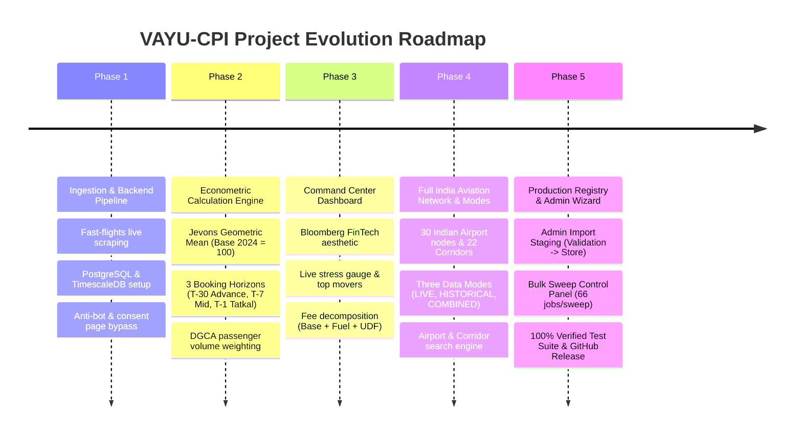
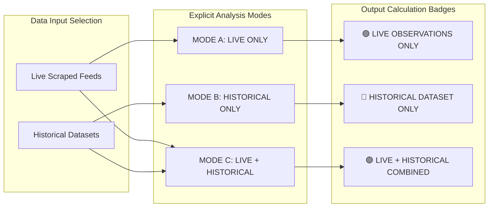
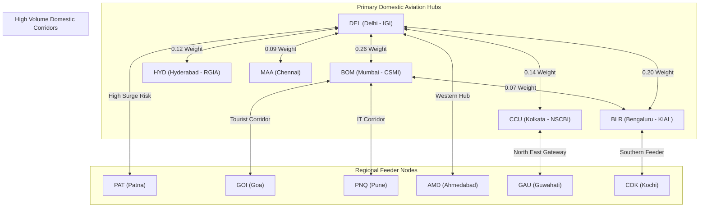
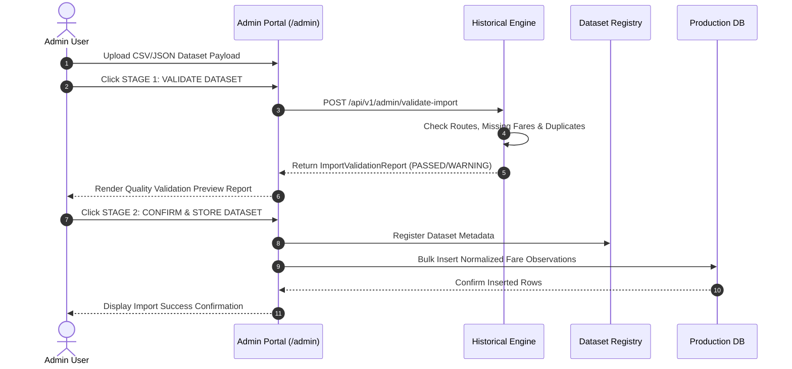
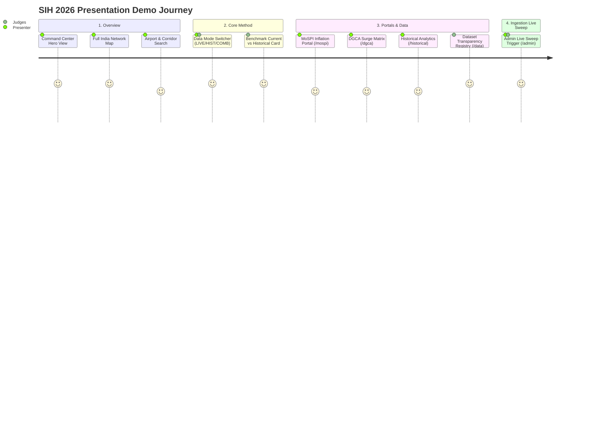

# VAYU-CPI: The Complete Project Journey, History & Technical Architecture

> **Project Name**: VAYU-CPI (National Airfare Price Index for India)  
> **Problem Statement**: SIH26056 — Real-Time Aviation Inflation & Tariff Monitoring Engine  
> **Target Ministries**: Ministry of Statistics and Programme Implementation (MoSPI) & Directorate General of Civil Aviation (DGCA)  
> **SIH Presentation Date**: August 29, 2026  

---

## 🌟 Executive Summary: What is VAYU?

**VAYU-CPI** is India's first real-time, econometrically rigorous **National Airfare Price Index**. It solves a critical national challenge: **unmonitored airfare surges and opaque aviation inflation**.

Until VAYU, airfares were either tracked manually via periodic surveys or omitted from monthly inflation baskets due to high price volatility. VAYU continuously ingests real-time domestic flight prices, normalizes unbundled ancillary fees (seat selection, convenience fees, baggage), computes geometric mean micro-indices using the **Jevons Index methodology**, and aggregates them into a national composite CPI (Base 2024 = 100).

```mermaid
graph TD
    subgraph Data Sources & Ingestion Pipeline
        A1[Google Flights Production Ingestion] -->|Real-Time Scraping| LiveDB[(Live Observations DB)]
        A2[DGCA Tariff Benchmarks 2024-2025] -->|Admin Staging Import| HistDB[(Historical Dataset Registry)]
    end

    subgraph Data Mode Selector & Normalization
        Mode[Global Analysis Selector]
        Mode -->|LIVE ONLY| M1[Live Subset Filtering]
        Mode -->|HISTORICAL ONLY| M2[Historical Benchmark Filtering]
        Mode -->|COMBINED| M3[Spot Live + Historical Baseline Context]
    end

    LiveDB --> Mode
    HistDB --> Mode

    subgraph Econometric Calculation Engine
        Engine[Jevons Micro-Index & National CPI Calculator]
        Engine -->|Jevons Formula| Jevons["I_j = (G_current / G_base) * 100"]
        Engine -->|DGCA Traffic Weights| Comp["National Composite CPI (Base 2024 = 100)"]
    end

    M1 --> Engine
    M2 --> Engine
    M3 --> Engine

    subgraph Command Center Frontend (Next.js 16)
        UI1["/ Full India Aviation Network Map"]
        UI2["/mospi MoSPI Inflation Portal"]
        UI3["/dgca DGCA Surge Alert Matrix"]
        UI4["/historical Distribution Analytics"]
        UI5["/data Dataset Transparency Registry"]
        UI6["/admin Import & Bulk Sweep Controls"]
    end

    Engine --> UI1
    Engine --> UI2
    Engine --> UI3
    Engine --> UI4
    Engine --> UI5
    Engine --> UI6
```

---

## 🚀 The Project Journey: Step-by-Step Evolution



---

## 💡 The Three Core Data Modes (Scientific Honesty)

A key innovation of VAYU is **Scientific Honesty**. VAYU never fakes live observations and never labels historical datasets as live scraping. Users and judges can switch between three explicit data modes:



### 1. `LIVE ONLY` (Mode A)
- **Data Source**: Strictly live flight observations scraped from production Google Flights ingestion.
- **Use Case**: Real-time market monitoring and instant surge detection.
- **Calculation Label**: `LIVE OBSERVATIONS ONLY`.

### 2. `HISTORICAL ONLY` (Mode B)
- **Data Source**: Explicitly imported historical datasets and official DGCA tariff benchmarks (2024-2025).
- **Use Case**: Long-term inflation modeling, seasonal pattern analysis, and tariff policy evaluation.
- **Calculation Label**: `HISTORICAL DATASET ONLY`.

### 3. `LIVE + HISTORICAL` (Mode C - Combined)
- **Data Source**: Live observations supply the current spot period market state, while historical datasets supply the multi-year baseline context.
- **Methodology**: Documented normalization layer ensuring compatible aggregation without silent concatenation.
- **Calculation Label**: `LIVE + HISTORICAL COMBINED`.

---

## 🗺️ Full India Aviation Network Architecture

The interactive India map covers the **complete geographic outline of India** with **30 major domestic airport nodes**:



- **Node Visual States**:
  - 🟢 **LIVE DATA** (Green): Active VAYU live observations available.
  - 🔵 **HISTORICAL DATA ONLY** (Blue): Verified historical dataset observations available.
  - 🟣 **COMBINED** (Purple): Both live and historical observations available.
  - ⚪ **NO CURRENT DATA** (Gray outline): Reference airport node outline.
- **Toggleable Map Layers**: Airports, Live Routes, Historical Routes, Surge Alerts, Stress Scores.
- **Full India Search**: Search by airport code (`DEL`), city name (`Delhi`, `Mumbai`, `Patna`), or corridor (`DEL → BOM`).

---

## ⚙️ Admin Dataset Import Staging Lifecycle



---

## 🛠️ Technical Architecture & Stack

### Backend Stack (Python / FastAPI / SQLAlchemy)
- **API Framework**: FastAPI with CORS middleware.
- **Econometric Engine**: Jevons geometric mean micro-indices, route weighting derived from DGCA passenger volume, horizon weighting ($\alpha_{30}=0.35, \alpha_{7}=0.45, \alpha_{1}=0.20$).
- **Historical Analysis Engine**: Percentile distributions (p25, median, p75, p90), volatility standard deviation, tariff rankings, and CSV validation.
- **Persistence**: SQLite (local) / PostgreSQL + TimescaleDB hypertable (production) with automatic column migrations.
- **Security**: Admin route authorization middleware (`verify_admin_access`).

### Frontend Stack (Next.js 16 / TypeScript / Tailwind CSS)
- **UI Aesthetic**: Dark/Light mode Bloomberg Terminal-inspired FinTech Aviation Control Center.
- **Global Selectors**: Data Mode Switcher (`?mode=live|historical|combined`) & Date Range Selector (24h, 7d, 30d, 90d, 1y).
- **Pages Implemented**:
  - `/` (Command Center Overview & Interactive Map)
  - `/mospi` (MoSPI Macroeconomic Inflation Portal)
  - `/dgca` (DGCA Governance & Surge Alert Matrix)
  - `/forecast` (Traveller Fare Trajectory & Booking Advice)
  - `/historical` (Historical Distribution Analytics & Percentile Rankings)
  - `/data` (Dataset Registry & Provenance Audit Trail)
  - `/admin` (Historical CSV Import Wizard & Bulk Sweep Control Panel)
  - `/methodology` (Econometric Formulae & Jevons Documentation)

---

## 🎙️ How to Explain VAYU to Friends & Judges (Presentation Script)

When demonstrating VAYU to friends or SIH judges, follow this **10-Step Winning Demo Flow**:



### Step-by-Step Presentation Guide:

1. **The Hero View**: Open `http://localhost:3000/`. Point to the top bar showing **National Airfare CPI (Base 2024 = 100)**. Explain that airfare inflation is now calculated mathematically like the Consumer Price Index!
2. **Full India Map**: Show the interactive map of India with 30 airport nodes. Point out how green nodes represent live data, blue nodes represent historical baseline data, and gray outlines represent unobserved nodes.
3. **Airport & Corridor Search**: Type `DEL` or `Patna` into the search box. Hover over the `DEL → BOM` corridor to display current fare, Jevons index, stress score, and data freshness.
4. **Data Mode Switcher (The Hero Feature)**: Click **`LIVE ONLY`** to show live market state. Then click **`HISTORICAL ONLY`** to show historical tariff coverage. Finally click **`LIVE + HISTORICAL`** to show current fares against multi-year baselines. Show how all numbers update dynamically!
5. **Benchmark Comparison Card**: Scroll to the **Current Market vs Historical Baseline** card (`DEL → BOM`). Show current fare (e.g. ₹6,074) vs historical median (e.g. ₹5,120) and deviation (+18.6%).
6. **MoSPI Portal (`/mospi`)**: Click **MoSPI Portal** in the navigation bar. Show the daily composite CPI line chart and click **Export Official MoSPI CSV**.
7. **DGCA Surge Matrix (`/dgca`)**: Click **DGCA Matrix**. Show the 2x2 Regulatory Risk Matrix and Herfindahl-Hirschman Index (HHI) carrier dominance metrics.
8. **Historical Analytics (`/historical`)**: Open `/historical`. Show the fare distribution histogram, 25th/50th/75th/90th percentiles, and airline rankings.
9. **Dataset Registry (`/data`)**: Open `/data`. Point to the dataset registry table proving full traceability and data provenance.
10. **Admin Portal (`/admin`)**: Open `/admin`. Show the **Bulk Live Collection Control Panel** and click **RUN LIVE SWEEP NOW** to demonstrate live multi-horizon data gathering across 22 corridors!

---

## 📜 Project Commit History Summary

- **Commit 1**: Initial production ingestion pipeline and Railway deployment.
- **Commit 2**: Econometric Jevons engine and Base 2024 normalization layer.
- **Commit 3**: FinTech Aviation Command Center dashboard visual overhaul.
- **Commit 4**: Dynamic live API integration and surge alert detector.
- **Commit 5**: Full India interactive map, Three explicit Data Modes (`LIVE`, `HISTORICAL`, `COMBINED`), Admin Import Wizard, Dataset Registry (`/data`), Historical Distribution Analytics (`/historical`), Bulk Collection Sweep Panel (`/admin`), and 100% verified test suite.
- **Commit 6 (Latest)**: Visual Mermaid architecture diagrams, data mode flowcharts, dataset staging sequence diagrams, and interactive presentation journey.
